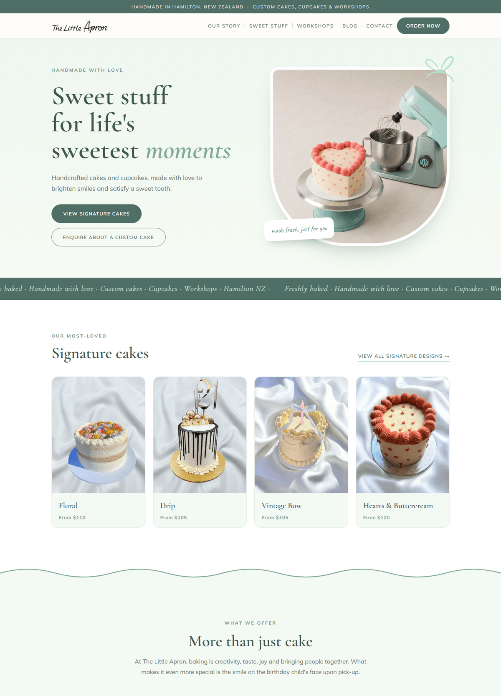
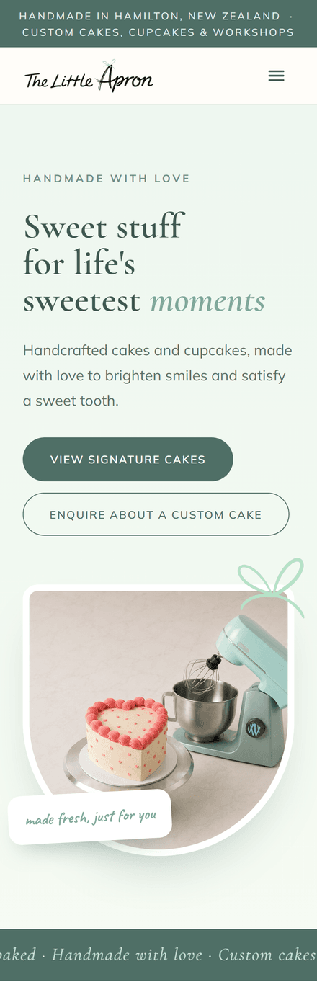

# The Little Apron Bakery

A responsive marketing and ordering site for a Hamilton, NZ home bakery — built
end to end from the design brief through to production deployment.

🔗 **Live site:** https://the-little-apron-bakery.vercel.app

🚧 Actively maintained — content and pages are still being added as the business
grows.

## Screenshots

**Desktop**



**Mobile**



## Features

- **12 pages** — home, our story, sweet stuff, signature cakes, cupcakes,
  workshops, order, contact, blog, FAQs, cake care, terms
- **Responsive layout** built mobile-first and reviewed at 390 / 820 / 1440px
- **Three working forms** — custom cake orders (with reference-photo upload),
  workshop bookings, and general contact — all delivering email through a single
  serverless function
- **Spam mitigation** — honeypot field plus a minimum time-to-submit check, with
  blocked submissions returning a fake success so bots get no signal
- **Attachment handling** — image uploads validated by extension, capped at five
  files, and size-limited below the serverless request ceiling
- **Signature cake gallery** driven from a single data file, so pricing and
  designs are updated in one place
- The blog page is scaffolded with placeholder posts marked "coming soon" —
  no live posts yet

## Tech stack

- **React 18** + **Vite 5** — no router; lightweight hash-based routing in
  `App.jsx`
- **Plain CSS** — global classes in `src/index.css` plus per-component inline
  styles; no CSS framework
- **Vercel serverless function** (`api/send-email.js`) sending via the Brevo
  transactional email API
- **Tooling** — ESLint, Prettier, `lint-staged` pre-commit hook, Sharp for image
  optimisation, Puppeteer for viewport screenshots
- **CI** — GitHub Actions runs lint, format check, and build on every PR;
  `main` auto-deploys to Vercel

## Running locally

```bash
npm install
npm run dev
```

Copy `.env.example` to `.env` and fill in the Brevo credentials if you need the
contact forms to actually send. Without them the site runs fine — only form
submission fails.

| Script                    | Does                                                 |
| ------------------------- | ---------------------------------------------------- |
| `npm run dev`             | Vite dev server                                      |
| `npm run build`           | Production build to `dist/`                          |
| `npm run preview`         | Serve the production build                           |
| `npm run lint`            | ESLint over the repo                                 |
| `npm run format`          | Prettier                                             |
| `npm run optimize-images` | One-off Sharp compression pass over `public/assets/` |
| `npm run screenshot`      | Capture a route at 390 / 820 / 1440px                |

## Project structure

```
api/            Vercel serverless function (email sending)
public/assets/  Images, referenced by literal path
scripts/        Image optimisation + screenshot tooling
src/
  App.jsx       Hash routing + shared form submission handler
  components/   Header, Footer, WaveDivider
  data/         Cake and social-link data
  pages/        One component per route
```

## How changes ship

`main` auto-deploys to production, so every change goes through a branch and a
pull request. CI must pass and Vercel posts a preview URL on each PR. See
[CLAUDE.md](CLAUDE.md) for the full working agreement.
